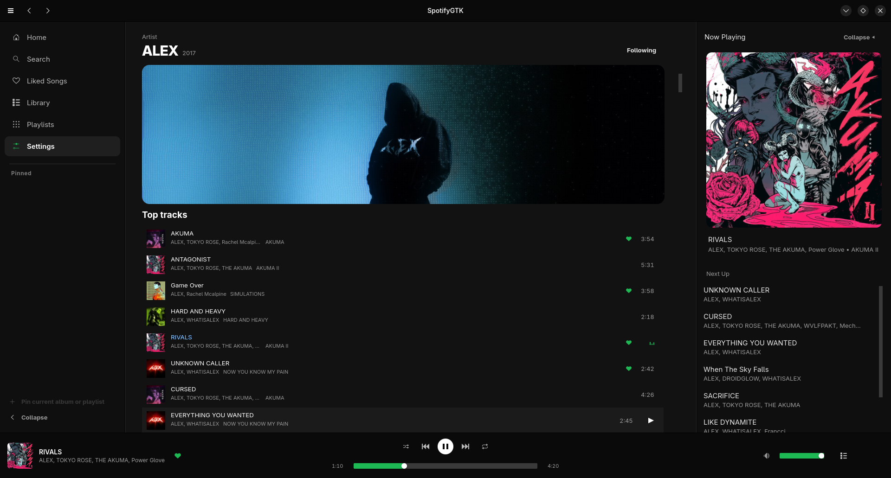
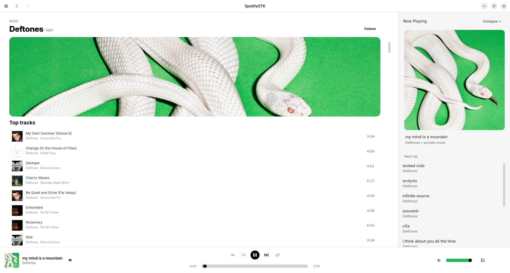
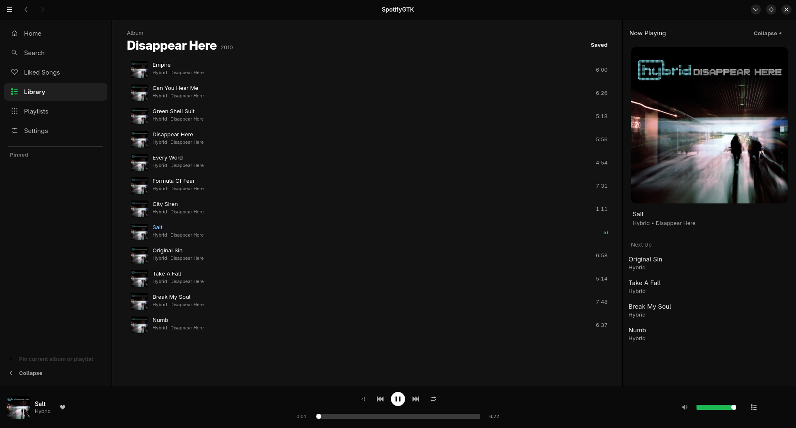
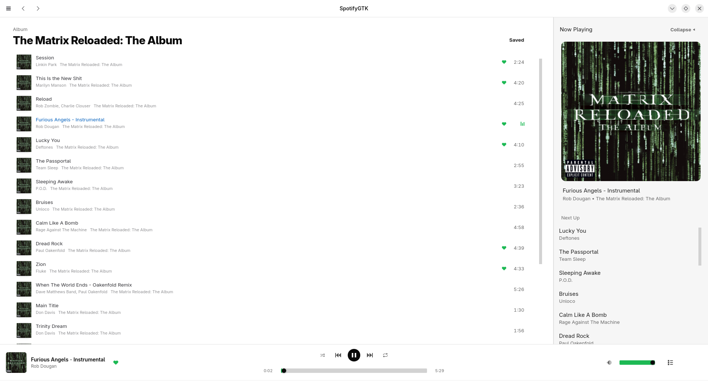
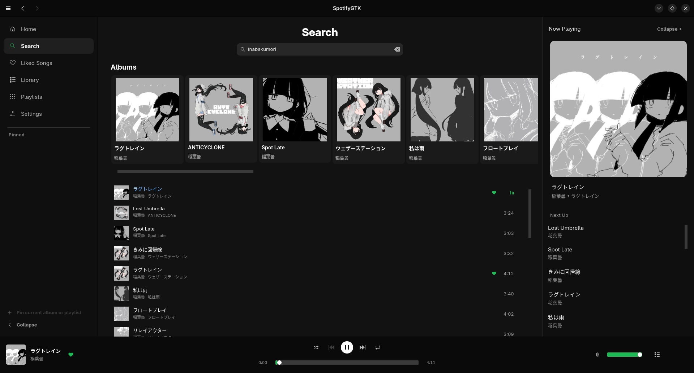
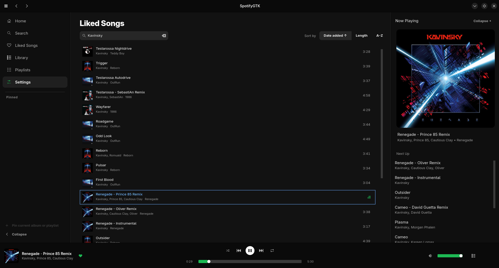
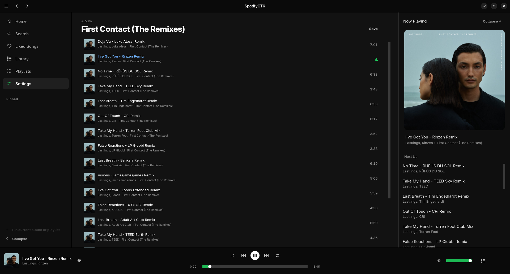
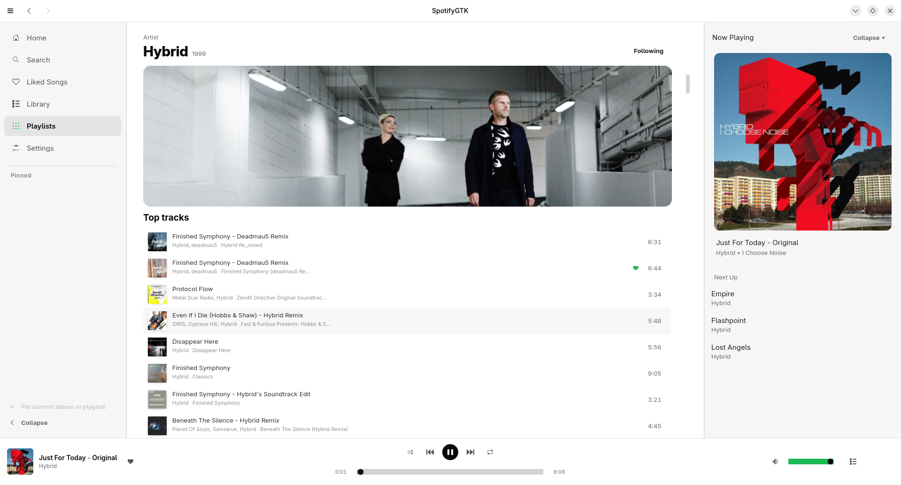

# SpotifyGTK

A native Spotify client for Linux and Windows, written entirely in **C** — no
Rust, no Electron. It speaks Spotify's own protocol directly: sign-in, catalog,
audio keys, CDN decrypt, Ogg/Vorbis playback and Spotify Connect, with a GTK4
and libadwaita interface.


> **A Spotify Premium account is required.** Free accounts cannot play through
> this client and never will — see [Requirements](#requirements).

---

## Screenshots

| | |
|:---:|:---:|
|  |  |
| **Artist** — banner, top tracks and the full discography | **Artist, light theme** — one of three palettes |
|  |  |
| **Album** — save it to your library from the header | **Album, light theme** |
|  |  |
| **Search** — albums and tracks together | **Liked Songs** — filter as you type, sort by date, length or title |
|  |  |
| **Now Playing** — artwork and the queue | **Following** — follow and unfollow from the artist page |

---

## Requirements

**Spotify Premium.** This is not a limitation of the client and not a missing
feature: the audio-key exchange is gated server-side. Verified against a live
server, a free account is refused a key for *every* file a track offers —
OGG_VORBIS 320, 160 and 96 and AAC_24 alike — so no client-side change reaches
playback. `librespot` has required Premium for the same reason since 2015.

**Support for free accounts will not be added.** There is nothing to add.

**Use at your own risk, with your own account.** This is a client for music you
already hold a licence to stream. Connecting to Spotify's service with
unofficial software is likely outside their Terms of Service; account
suspension is the realistic consequence and is accepted knowingly by whoever
runs it. Nothing here bypasses a Premium or licensing check, and this is not a
downloader. See [research/legal.md](research/legal.md) for the full position.

---

## Building

```bash
cd apps/spotify-native
meson setup build --native-file build-profiles/stable.ini
ninja -C build
./build/src/spotify-native
```

`--native-file build-profiles/nightly.ini` swaps in the newer audio backend
(PipeWire). `-Denable_gui=false` builds the engine and CLI harness without GTK.

**Dependencies**

```bash
# Debian / Ubuntu 24.04+
sudo apt install meson ninja-build pkg-config libglib2.0-dev libsoup-3.0-dev \
                 libjson-glib-dev libgtk-4-dev libadwaita-1-dev libogg-dev \
                 libvorbis-dev libssl-dev libpulse-dev libasound2-dev

# Fedora
sudo dnf install meson ninja-build pkg-config glib2-devel libsoup3-devel \
                 json-glib-devel gtk4-devel libadwaita-devel libogg-devel \
                 libvorbis-devel openssl-devel pulseaudio-libs-devel \
                 alsa-lib-devel

# Arch
sudo pacman -S meson glib2 libsoup3 json-glib gtk4 libadwaita libogg \
               libvorbis openssl libpulse alsa-lib
```

Add `libpipewire-0.3-dev` / `pipewire-devel` / `pipewire` for the nightly track.
The interface is laid out against GTK 4.22.4 and libadwaita 1.9.0. Older
distribution packages, including Ubuntu 24.04's defaults, can still build with
`-Dallow_old_gtk=true`, but widget sizing and spacing may differ.

First run opens a browser to authorise your account; the token is stored
locally and reused.

Building on **Windows** is a different set of steps —
see [apps/spotify-native-windows/README.md](apps/spotify-native-windows/README.md#building-and-running-it-on-windows).

---

## What works

Playback is gapless, seekable, and survives a dropped connection. Search, Liked
Songs, playlists, albums and artist pages all load over the native protocol.
You can like tracks, save albums, follow artists, and create and delete
playlists. There is a 15-band equaliser, an optional resampler, shuffle and
repeat.

Spotify Connect is integrated into the native player. SpotifyGTK appears as an
available device in official Spotify clients, accepts playback transfer and
remote play, pause, seek, previous and next commands, and yields audio when a
different device takes ownership. Track, play state and elapsed-position
updates stay synchronized with other Spotify clients and with Spotify-linked
Discord activity.

Search returns up to 150 ranked tracks. Starting a search result builds a song
radio queue instead of walking down the result list; radio expands and
deduplicates recommendations up to a 200-track target. Playlist, album, Liked
Songs and artist contexts retain their natural order and ordinary shuffle
behavior.

Smart Shuffle is Connect-aware: official clients can enable it, SpotifyGTK
fetches and interleaves song-radio recommendations, and disabling it restores
the original sequential queue rather than leaving recommendations behind.

Windows is supported and plays through WASAPI — sign-in, streaming and
playback are all verified on real hardware. Build it with
[the Windows instructions](apps/spotify-native-windows/README.md#building-and-running-it-on-windows),
which are step-by-step from installing MSYS2 onwards.

Per-subsystem status, architecture and measured performance live in
[research/internals.md](research/internals.md).

---

## Repository layout

```
apps/spotify-connect/   Web API control client (HTTP + JSON only) -- own README
apps/spotify-native/    The player: protocol, audio engine, GTK4 interface
apps/spotify-native-windows/   Windows toolchain and packaging
research/               Protocol findings, internals, legal position
```

The two apps are separate because their dependencies are: the control client is
HTTP and JSON and will run on a microcontroller, while the player needs a decode
pipeline and a sound server. Splitting them keeps each one's dependency list to
what it actually uses.

---

## Contributing

Findings ported into `apps/spotify-native/src/spotify/` should note the upstream
file they came from — see `THIRD_PARTY_LICENSES`.

Run the tests with `meson test -C build --print-errorlogs`. Development
switches, the roadmap and the design principles are in
[research/internals.md](research/internals.md).

---

## License

**GNU General Public License v3.0** — see [LICENSE](LICENSE).

One additional term, under GPLv3 Section 7(b): redistributions and works based
on this one must keep the attribution and link back to
<https://github.com/martiancomputer/SpotifyGTK> in their documentation and
credits. That is an attribution requirement, not a restriction — every freedom
the GPL grants still applies.

Portions of `apps/spotify-native` are ported from or reference
[`librespot`](https://github.com/librespot-org/librespot) and the `shannon`
crate it depends on (both MIT) — see `THIRD_PARTY_LICENSES` for attribution.

SpotifyGTK is an independent open-source project, not affiliated with or
endorsed by Spotify AB. "Spotify" is a trademark of Spotify AB.
