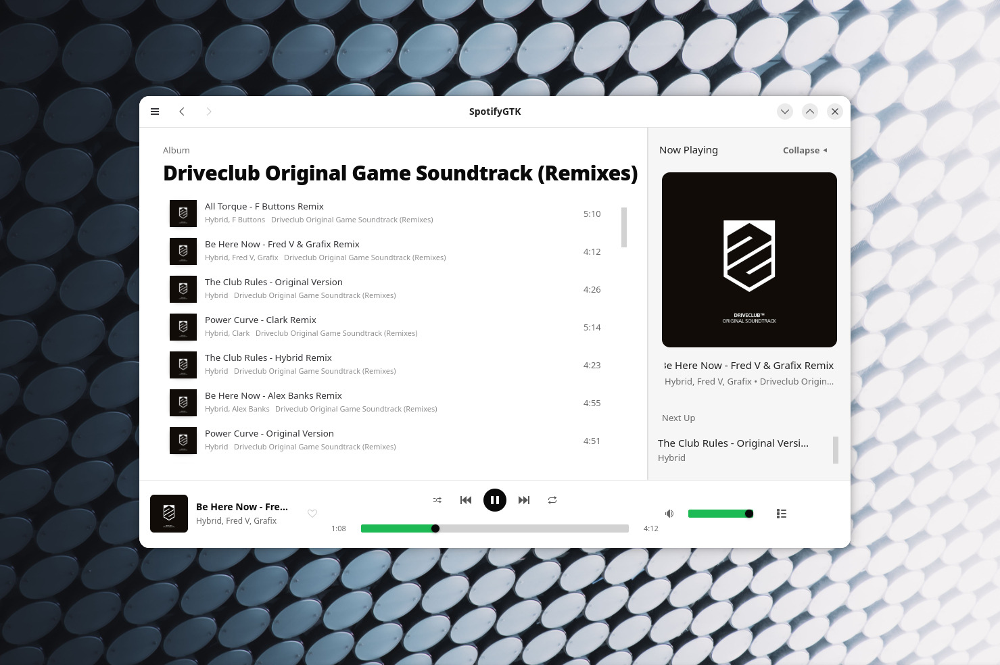
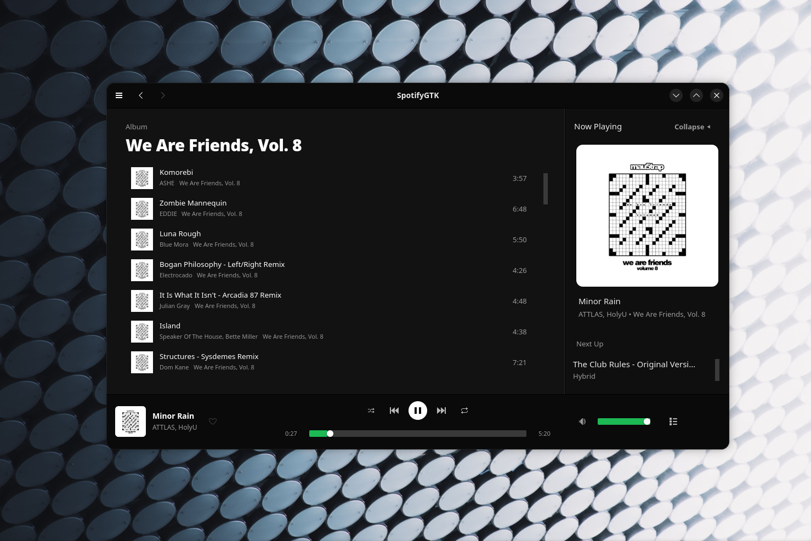
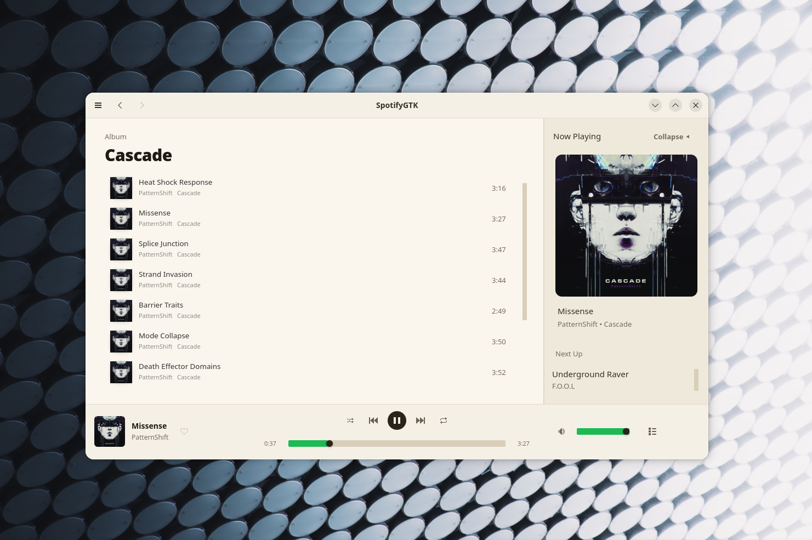
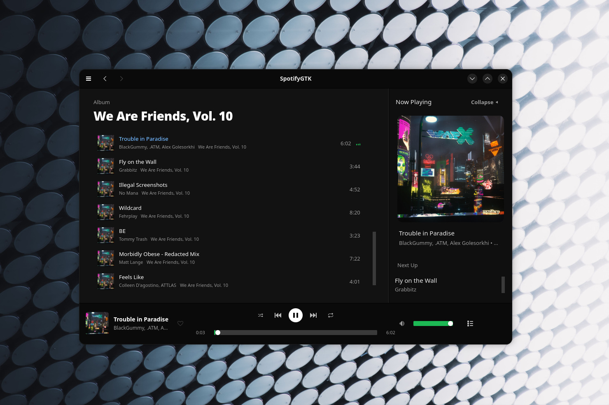

# SpotifyGTK

A native Spotify client project for Linux — and now Windows, where it signs in,
streams and plays through WASAPI — written entirely in **C**, zero Rust, zero
Electron. Built for raw performance and long-term stability rather than
convenience.


## Screenshots

The album view with the Now Playing panel open. Track lists, album art and the
queue all arrive over the native protocol stack — no Web API involved.

| Light | Dark |
|---|---|
|  |  |
|  |  |

---

## Project layout

This is a monorepo containing **two independent apps**, a Windows build target
for the second of them, and the research behind both. Each app has its own
`meson.build` and is built separately.

```
SpotifyGTK/
├── apps/
│   ├── spotify-connect/      Web API control client (functional today)
│   ├── spotify-native/       Standalone engine: protocol + audio (in progress)
│   └── spotify-native-windows/  Windows toolchain + packaging for the above
│                             (no source of its own -- see its README)
│
├── research/                 Protocol reverse-engineering notes, by area
│   ├── auth/                 AP handshake, Diffie-Hellman, Shannon cipher
│   ├── metadata/              Mercury pub/sub
│   ├── connect/               Spirc/dealer, device registration, ad-insertion
│   └── playback/              Audio key + CDN decrypt, streaming auth-relay chain
│
├── docs/                      General project documentation
└── THIRD_PARTY_LICENSES       Attribution for ported/referenced code
```

### Why two apps

The Web API control surface (`auth.c`, `api.c`, search, playback *control*)
and the standalone protocol/audio engine (`spotify/`, `audio/`) turned out to
have very different hardware requirements. The former is just HTTP + JSON —
light enough to run on an MCU or any resource-constrained board, and needs
no audio decode libraries, no PulseAudio/ALSA, nothing audio-related at all.
The latter needs a real decode pipeline and benefits from GPU acceleration —
a desktop-class target. Splitting them let each app's dependency list shrink
to only what it actually uses, instead of one binary linking everything.

---

## `apps/spotify-connect`

Controls an **existing** Spotify Connect device (phone, desktop app, speaker)
via the official Web API. Requires Spotify Premium (Spotify's Web Playback
endpoints are Premium-gated). Doesn't play audio itself — it tells an already-
active device what to do. This is the lightweight, MCU-capable half of the
project, and it's the part that's functional today.

**Stack:** GTK4 / libadwaita UI, libsoup3, json-glib, OAuth 2.0 PKCE.

| Module | Status |
|---|---|
| OAuth 2.0 PKCE | ✅ Functional |
| Web API wrapper | ✅ Functional |
| Search → playback control | ✅ Functional |
| Image cache (LRU + disk + libjpeg-turbo/stb_image) | ✅ Functional |
| Diagnostic logging (status codes, request/response tracing) | ✅ Functional |

### Building

```bash
cd apps/spotify-connect
meson setup build --native-file build-profiles/stable.ini
# or: meson setup build --native-file build-profiles/nightly.ini
ninja -C build
```

### Authentication

OAuth 2.0 Authorization Code + PKCE — no client secret ever stored on disk.

1. Register an app at [developer.spotify.com/dashboard](https://developer.spotify.com/dashboard)
2. Add redirect URI: `http://127.0.0.1:8888/callback`
3. Copy your **Client ID**, then:

```bash
export SPOTIFY_CLIENT_ID="your_client_id_here"
./build/src/spotify-connect
```

Your browser opens for login; the token is captured on `127.0.0.1:8888` and
stored via **libsecret** (or `~/.config/spotifygtk/tokens`, `chmod 600`, if
libsecret isn't available).

### Install system-wide

```bash
sudo ninja -C build install
```

### Two release tracks: Stable & Nightly

| | **Stable** | **Nightly** |
|---|---|---|
| GTK | 4.0+ | 4.14+ |
| Image decode | stb_image / libjpeg-turbo | + VA-API hardware decode |
| Texture upload | `gdk_memory_texture_new()` | `GdkDmabufTexture` (zero-copy) |
| Targets | Ubuntu 22.04+, RHEL 9, Debian 12 | Arch, Fedora, Ubuntu 24.04+ |

### Prerequisites

**Ubuntu / Debian (24.04+)**
```bash
sudo apt install \
  meson ninja-build pkg-config \
  libgtk-4-dev libadwaita-1-dev \
  libsoup-3.0-dev libjson-glib-dev \
  libsecret-1-dev libglib2.0-dev \
  libjpeg-turbo8-dev
# Nightly only:
sudo apt install libva-dev libva-drm2
```

**Fedora / RHEL**
```bash
sudo dnf install \
  meson ninja-build pkg-config \
  gtk4-devel libadwaita-devel \
  libsoup3-devel json-glib-devel \
  libsecret-devel glib2-devel \
  libjpeg-turbo-devel
```

**Arch Linux**
```bash
sudo pacman -S meson gtk4 libadwaita libsoup3 json-glib libsecret \
  libjpeg-turbo libva
```

---

## `apps/spotify-native`

The original objective: a fully standalone client that's its own Spotify
Connect device, with its own audio decode and output pipeline — no other
Spotify client needs to be running. GPU-accelerated where hardware allows
(VA-API hardware JPEG decode planned; Vulkan compositing not started).

**A working client for a narrow slice, not a finished one.** Search, Liked
Songs, and the album shelves on Home, Search and Library all load over the
native protocol stack — no Web API involved — and tracks play, pause, resume,
**seek**, switch, and respond to the volume slider, a **15-band graphic
equaliser** with a draggable response curve, and an optional **resampler**. Previous/Next, a play queue, and a right-click track menu (Add to
Queue, Go to Album, Go to Artist) work too, all driven from the UI's own
play-context since the engine plays one track at a time. Home, Search and
Library now show the **real albums present in your results and collection**,
grouped from the track metadata (the native stack has no album-listing
endpoint, so the distinct albums a track list already carries are what's
displayed); a card opens the real album. Browser-style **Back/Forward**
navigation, a **sign-in gate** that stays up until the session is genuinely
ready (with Log out in Settings), a local **Liked Songs filter** with a
three-way **sort** (date added / length / A–Z, each reversible), and an album's
**release year** beside its title round out the shell. Loads are **paged**, so a
whole collection arrives rather than the first batch of it. Still absent:
shuffle, repeat, and like — like needs a library-write path over Mercury and
`collection2v2`; the message encoding is written and tested but Mercury itself
has never run against a server, so that is the blocker rather than the endpoint.
Playlists (the `playlist4_external` rootlist) and listening history have no data
source yet; Playlists has its own page saying so, and Recently Played says so in
place. The standalone harness remains the
protocol/playback validation tool. See Project status below for the exact
breakdown — rows marked ✅ have been confirmed against live Spotify servers,
not merely written.

### Building

```bash
cd apps/spotify-native
meson setup build --native-file build-profiles/stable.ini
# or: meson setup build --native-file build-profiles/nightly.ini
ninja -C build
./build/src/spotify-native-harness
# Basic GTK4 engine shell:
./build/src/spotify-native
```

The GTK shell launches `spotify-native-harness` as its current playback
bridge; both executables are installed together by `ninja -C build install`.

For a headless engine/harness build, configure Meson with
`-Denable_gui=false`.

### Development switches

All are environment variables, all off by default.

| Variable | Applies to | Effect |
|---|---|---|
| `SPOTIFY_PROBE_SESSION="<query>"` | harness | Signs in via `SpotifyNativeSession` and prints the tracks a search would render. `="collection"` lists liked songs instead. |
| `SPOTIFY_PROBE_SESSION=dispose` | harness | Tears down sessions mid-sign-in to exercise the shutdown race. Hangs on regression; SIGTERM cannot test this, since the process dies without running `dispose`. |
| `SPOTIFY_PROBE_CONTEXT="<query>"` | harness | Runs the raw chain (AP login → client-token → login5 → context-resolve → batched metadata) and dumps the response shape. Replaces playback, so a diagnostic failure can't be confused with a pipeline failure. |
| `SPOTIFY_PROBE_LIMIT=<n>` | harness | Caps how many URIs the batched-metadata probe resolves. |
| `SPOTIFY_START_PAGE=<name>` | GUI | Opens straight onto `home`, `search`, `liked` or `library`. |
| `SPOTIFY_DEV_INSTANCE=1` | GUI | Runs non-unique, so a freshly built copy can launch while another is already open. |

**Verifying a build actually contains your change.** Meson/ninja has been
seen to leave a stale object file behind, producing a binary that links an
older translation unit while reporting a successful build — in one case the
executable still had a removed button compiled in. A green build is not
proof. Confirm with `strings build/src/spotify-native | grep <symbol>`, or
`ninja -C build -t clean && ninja -C build` before any visual check.

### Legal & ethical approach

This part of the project reimplements Spotify's binary protocol, which is
worth being direct about. Two real-world precedents shape how this is built:

- **GitHub took down `whoeevee/EeveeSpotify` in August 2025** — but notably,
  GitHub *rejected* Spotify's DMCA anti-circumvention (§1201) claim as
  insufficiently supported. The takedown succeeded on a different ground:
  GitHub's own Acceptable Use Policy against software that patches an official
  app binary to bypass Premium/licensing checks. EeveeSpotify modified
  Spotify's actual compiled app and unlocked paid features for free.
- **`librespot`** (MIT-licensed, ~6.7k stars) has done a clean-room
  reimplementation of this same protocol — AP connection, Shannon cipher,
  Mercury, audio key exchange, CDN decrypt — continuously since 2015, with no
  DMCA action against it, while requiring users' own real accounts.

The operating principles here follow directly from that contrast:

1. **Clean-room only.** No decompiling or copying Spotify's actual app
   binaries or extracted assets.
2. **Requires a real, paid Spotify account.** Nothing here bypasses a Premium
   or licensing check — that's the specific thing that's actually been
   enforced against, separate from the protocol-reimplementation question.
   This is also simply what the protocol does, verified against a live server:
   a free account is refused an audio key for *every* file a track offers —
   OGG_VORBIS 320, 160 and 96 and AAC_24 alike — so the gate is the audio-key
   exchange itself rather than any format or bitrate. Playback on a free
   account is not a missing feature and no client-side change reaches it;
   `librespot` has required Premium for the same reason since its beginning.
3. **Playback only, never a downloader.** This is a client for content you're
   already licensed to stream, not a bulk-export/DRM-stripping tool.
4. **Faithful, not selectively faithful.** Should a free-tier playback path
   ever become reachable, its ad-insertion and feature-state events get
   implemented along with everything else (tracked in `research/connect/`) —
   the goal is an alternative client, not an accidental ad-stripper that
   happens to also play music. As point 2 notes, that path is not reachable
   today, so this is a standing commitment rather than a to-do item.
5. **`librespot`'s MIT-licensed work is primary reference material**, properly
   attributed in `THIRD_PARTY_LICENSES`, rather than starting from raw packet
   captures. They already did the clean-room work; their license permits
   building on it.
6. **Same disclaimer librespot carries:** using this to connect to Spotify's
   service is probably against their Terms of Service. Use at your own risk.
   This is a Terms-of-Service question, separate from the copyright/DMCA
   question above — account suspension is the realistic consequence, accepted
   knowingly. This isn't legal advice; the DMCA §1201 question for protocol
   clients specifically hasn't been tested in court.

### Project status

Being direct about what's implemented vs. scaffolded, because a stream cipher
or DH handshake that *looks* done but is subtly wrong is worse than an honest
gap:

| Module | Status |
|---|---|
| Shannon cipher (`spotify/shannon.c`) | ✅ Confirmed against real ground-truth test vectors (a compiled-and-run copy of the actual reference crate, not read-and-reasoned-about). Note: the internal round-trip self-test alone had passed for a while despite a real bug (`sbox1`/`sbox2` used XOR where the reference uses OR) — that class of test can't catch a deviation applied symmetrically to both encrypt and decrypt. See `research/auth/` for the full writeup. |
| Ogg/Vorbis decoder (`audio/decoder.c`) | ✅ Confirmed against a live decrypted Spotify CDN range: 44.1 kHz stereo, 86,592 PCM frames from the initial 64 KiB probe. |
| Audio output: PulseAudio, ALSA | ✅ Functional; PulseAudio live-validated with 86,592 decoded Spotify PCM frames. |
| Output volume | ✅ Applied in software, in the audio worker. Every backend declares `.set_volume = NULL` — Pulse, ALSA and PipeWire all leave per-stream volume as a TODO — so routing the UI slider to `spotifygtk_output_set_volume()` reached a stub and silently did nothing. Scaling the PCM buffer works on every backend and needs nothing from them, which is the same pure-C fallback rule the rest of the project follows. The curve is cubic: perceived loudness is roughly logarithmic, so a linear slider sounds loud for most of its travel and then falls off a cliff. |
| 15-band graphic equaliser (`audio/dsp.c`, `ui/eq_graph.c`) | ✅ Functional. RBJ-cookbook peaking biquads at ISO 2/3-octave centres (25 Hz–16 kHz), ±12 dB per band, applied in the audio worker after volume and before output — the same push-from-the-UI path volume uses. Q tracks the spacing (2.145); the earlier ten octave-spaced bands used √2. Enabled-but-flat and disabled both short-circuit to a byte-exact no-op; gains persist in `settings.ini`. Unit-tested in `tests/test_dsp.c`; pure PCM DSP, so no live-server dependency. The UI is a drawn response curve, not a slider strip: `spotifygtk_eq_response_curve()` evaluates the real cascade magnitude per pixel column (coefficients computed once per curve, curve cached until a gain or the width changes — evaluating per pixel per frame was visibly laggy), and the handles are dragged on the curve itself. |
| Sample-rate resampler (`audio/resampler.c`) | ✅ Functional, unit-tested; **not yet listened to.** Polyphase windowed-sinc (Kaiser β 8.6, 32 taps, 256 phases, linear phase interpolation). Downsampling moves the cutoff below the output Nyquist so nothing folds back; each phase row is normalised so DC does not ripple as the phase walks. Equal rates are a byte-exact passthrough and remain the default — converting 44.1 kHz cannot add information, and the short path is better unless something downstream would resample anyway. Wired end to end: the Sample rate setting reaches the engine control, the audio worker opens the device at that rate and converts each block, and position reporting follows the device rate. Five offline tests in `tests/test_resampler.c` cover passthrough exactness, frame-count ratio, tone level, DC stability, and rejection of a tone above the new Nyquist. |
| Audio output: PipeWire | 🟡 Implemented, needs validation against a running PipeWire instance |
| Audio output: WASAPI (Windows) | 🟡 Implemented, cross-compile verified, **never run**. Shared-mode `IAudioClient` + `IAudioRenderClient`, blocking write for backpressure, `ISimpleAudioVolume` when the endpoint offers it, COM initialised on the audio worker that also tears it down. Opened with `AUTOCONVERT_PCM` so a 44.1 kHz stream still opens on a 48 kHz mixer, retrying without the flag for drivers that reject it. Compiles **and links** into a Windows `.exe` against real mingw-w64 headers with `-Wall -Wextra` and no warnings, which confirms the `COBJMACROS` forms and that `INITGUID` resolves the CLSIDs/IIDs without a uuid library — but compiling is not running. See `apps/spotify-native-windows/README.md`. |
| AP handshake (`spotify/ap.c`, `dh.c`, `handshake_crypto.c`, `protobuf_min.c`) | ✅ Confirmed working against a real Spotify server — DH exchange, RSA server-signature verification, and HMAC-SHA1 key derivation all checked out. |
| AP login (`spotify/ap.c`, `spotify/native_auth.c`) | ✅ Confirmed working against a real Spotify server. Four real bugs found and fixed on the way here, each caught by a live server rejecting the previous fix rather than by any test that existed at the time: wrong client_id/scopes, a wrong protobuf field number plus missing required fields in the login message, a Shannon cipher bug (the actual root cause underneath both) that broke every encrypted packet regardless of content, and — found after login was already succeeding — a wrong field number for `canonical_username` that silently dropped it from every login. |
| Mercury protocol (`spotify/mercury.c`) | 🟡 Framing implemented, unverified against live traffic |
| Audio key exchange (`spotify/audio_key.c`) | ✅ Confirmed against a live AP session; retrieves a usable 16-byte AES key. |
| Streaming auth-relay (`spotify/clienttoken.c`, `spotify/login5.c`, `spotify/spclient.c`) | ✅ Confirmed live: reusable AP credential → client-token → login5 bearer → track metadata → CDN URL resolution. `spclient.c` still uses librespot's hardcoded fallback host rather than full `apresolve`. See `research/playback/`. |
| CDN fetch + AES-CTR decrypt (`spotify/cdn.c`) | ✅ Confirmed live for the initial range and an independent non-block-aligned range; plaintext begins with `OggS` and decodes to PCM. |
| Native playback worker (`native_engine.h`, `player_service.c`) | 🟡 Runs the validated pipeline off the GTK thread, reports CONNECTING/BUFFERING/PLAYING/PAUSED stages, feeds decrypted CDN ranges into a bounded PCM queue with a dedicated output worker, propagates cancellation, and supports pause/resume, volume, and switching tracks mid-playback. Two bugs worth remembering: `start_uri()` used to return `G_IO_ERROR_BUSY` whenever anything was already playing, so picking a second track did nothing at all; and `pause()` emitted `PLAYING`, which left the bar showing a pause icon while paused, so the next click paused again and resume was unreachable. **Playback position is now reported**: the audio worker publishes cumulative frames-written onto the engine control, `player_service` polls it 4×/second and emits `position-changed`, and the bar's progress fill and time labels track the playing track (paused/stalled audio holds position, since only device-written frames count). **Seek now works**: the engine walks Ogg pages, replays the cached id/comment/setup header into a fresh decoder, and fetches a landing window at the requested byte offset, so the progress slider is draggable (debounced, pause-state preserved across the seek). **Stability fix (this pass):** the UI cancellable was only *checked* at the pause/queue waits and threaded into the CDN fetcher — it never quit the engine's main loop — so a stream that stalled with no async op in flight left the worker running forever, freezing the timestamp and making every later track unplayable until a restart. A `g_cancellable_source_new` on the engine context now quits the loop on Stop/track-switch, so the worker unwinds and the next track plays. **Thread-affinity fix (root cause of the freezes and the SIGSEGVs):** the AP reconnect retry was scheduled with `g_timeout_add()`, which attaches to the *global default* context — so the retry fired on the GTK main thread, and everything chained off the reconnect (client-token, login5, spclient, every CDN range) bound to the main context too, because libsoup/GTask capture the thread-default at call time. Core dumps showed `on_range_response` running under `g_application_run` with `stream_queue_frame` blocked in `g_cond_wait_until` — i.e. the UI thread waiting on the audio queue — and the engine state machine running on two threads at once, freeing a socket client under the other (SIGSEGV in `g_object_ref`). Both retry sites now attach a `GSource` to their own context. The retry path is routine (a fresh AP connection per track), which is why it fired so often. A play queue and Previous/Next exist as a *UI* layer over this one-track-at-a-time engine (`ui/window.c`): the window holds the current list as a play-context plus a user queue and hands the engine the next URI when a track finishes (natural completion arrives as `IDLE`; a user-driven switch never does, so the two never collide). |
| Spotify Connect registration (`spotify/connect.c`) | 🟡 Mercury subscription real, device-state payload pending real protobuf schema; ad-insertion events not yet researched |
| Image cache VA-API hardware decode | 🟡 Probe works, decode path stubbed (lives in `spotify-connect`, shared concept) |
| Vulkan compositing | ⬜ Not started |
| GTK4 UI shell (`gui_main.c`, `ui/`) | 🟡 libadwaita shell (`ui/`, built when libadwaita ≥ 1.4 is present; `gui_main.c` remains the fallback), laid out to a supplied reference design: `GtkHeaderBar` chrome, icon sidebar with pill selection and a Pinned section, three-column playback bar with the progress row under the transport, and a Now Playing panel whose cover is aspect-locked to the panel width via `GtkAspectFrame`. **Search and Liked Songs run entirely on the native protocol stack** — confirmed in the running GUI, which signs in via the session and renders real tracks with no Web API call. **Home, Search and Library are now populated**: each shows the distinct albums present in a resolved track list (search results, or the Liked Songs collection), as cards that open the real album via the same `context_page` — real data grouped from the tracks, not invented, since the native stack has no album-listing endpoint. Only the sections with genuinely no data source (Recently Played, playlists) stay empty and state why. Previous/Next are live (backed by the UI play-context and queue), as is a right-click track menu — Add to Queue, Go to Album, Go to Artist — where album/artist open the shared `context_page` resolved from URIs `track_meta` extracts from each track's Album/Artist gid (confirmed live: every collection and search track came back with valid 22-char base62 album+artist URIs). Also present: a 15-band equaliser in Settings, browser-style Back/Forward header navigation over a page-history stack, a local Liked Songs filter, a frosted (gradient) search header the results scroll under, and a marquee Now Playing title that scrolls when long instead of forcing the panel off-screen. A **login gate** covers the whole window until the session reports READY (a stored token is not proof it works) and returns on FAILED, with **Log out** under Settings → Account clearing both the in-memory tokens and the stored token file. The album shelves and grid are virtualised (`GtkGridView` / horizontal `GtkListView`): the first version built one card per album, and since each card's `GtkImage` holds its own texture reference, several hundred cards pinned ~75 MB of covers the bounded cache could not reclaim. Liked Songs has a reversible three-way sort (date added / length / A–Z); date-added sorts on the collection's own newest-first ordering, since the `added_at` timestamp lives in `collection2v2` and cannot yet be read. An album's release year sits beside its title, parsed from `Track.album.date`. Every scroller animates the wheel toward a target rather than stepping, so the wheel and the scrollbar move alike. Still disabled: shuffle, repeat, and like / Add to Playlist (no library-write endpoint). The duplicate Settings/Notifications icons that used to sit on the Home header were removed — the sidebar's Settings item is the single working entry point. |
| ⚠️ Search relevance | 🟡 Known limitation. `/context-resolve/v1/spotify:search:<q>` is **not a search-results endpoint** — it returns a *playback context*, i.e. what Spotify would queue if you hit play on that search. "bohemian rhapsody" comes back with Blinding Lights first and the Queen tracks at #2–4, then Hotel California and Billie Jean. librespot documents the same behaviour ("massively influenced by the provided query") and implements no real search. The search page applies a client-side relevance filter on title and artist as a mitigation, falling back to the unfiltered list if nothing matches. A proper fix needs Spotify's actual search API, which is not in librespot and has not been identified. |
| ⚠️ `gui_main.c` fallback | 🔴 Still calls `api.spotify.com` with the keymaster token, so the non-libadwaita build has the shared-quota 429 problem described above. Only the `ui/` shell was migrated. |
| ⚠️ Catalog data path | ✅ **Migrated off the Web API.** The native shell used to mint a token from the keymaster `client_id` (`native_auth.h`) and send it to `api.spotify.com`. Spotify meters the Web API per `client_id`, and that one is Spotify's own internal ID — shared by every librespot user — so every request drew on a globally-contended quota and returned `429 API rate limit exceeded`. Diagnosed by elimination: no token and a garbage token both return `401` from the same host, so a 429 required a *valid* token on a throttled `client_id`, and `Retry-After` moved independently of our own request rate. librespot never calls `api.spotify.com` at all (zero references in its repo). `apps/spotify-native/src/ui/` now contains no reference to the Web API client. |
| Reusable native session (`spotify/session.c`) | ✅ Confirmed live. Holds the AP login → client-token → login5 chain open instead of tearing it down per playback attempt, and serves catalog queries against it. Runs its own worker thread and `GMainContext` — the same isolation `run_live_test()` uses, so protocol callbacks can never dispatch on the GTK thread — while the public API is main-thread-facing and returns results via `GTask`. `load_tracks()` does both round trips (context-resolve, then batched metadata) because neither alone yields a renderable row. Written against the existing public modules rather than by refactoring `main.c`, so the playback harness is untouched. Renews the login5 bearer before it expires (it lasts 3600s); without that the session kept reporting READY while every request 401'd — a silent death about an hour in. Disposing a session mid-sign-in used to deadlock, because `dispose()` found a NULL loop, skipped the quit, then blocked in `g_thread_join` while the worker went on to run one; the loop is now published and claimed under the lock. `SPOTIFY_PROBE_SESSION=dispose` exercises that race directly, since SIGTERM cannot (the process dies without running `dispose`). |
| Track display metadata (`spotify/track_meta.c`) | ✅ Confirmed live. Extracts name/album/artist/duration/explicit — and now the Album/Artist `gid` (field 1), base62-encoded to `spotify:album:<id>` / `spotify:artist:<id>` so the row menu can navigate — from the `Track` message `spclient.c` already fetches for playback and previously discarded. The base62 encoder is cross-checked in `tests/test_track_meta.c` against an independent big-integer reference (not against itself), and confirmed live: every collection and search track resolved to valid 22-char ids. Field numbers transcribed from `metadata.proto` and asserted as literals in `tests/test_track_meta.c`. **`duration` is zigzag-encoded `sint32`** — an earlier revision of this file asserted the opposite in a comment, and reading it as a plain varint returned exactly double (Rick Astley's "Never Gonna Give You Up" as 7:07 instead of 3:33). Only live data caught it; the offline round-trip test had happily agreed with the wrong encoder. Now pinned by a regression test using real track lengths. |
| Context resolution (`spotify/spclient.c`) | ✅ Confirmed live. `/context-resolve/v1/{uri}` — the single endpoint behind search, liked songs, and playlist/album/artist listings; returns JSON, unlike the rest of spclient. Search for "never gonna give you up" returned 20 correct tracks; `spotify:user:<id>:collection` returned a 4,773-track library. **`ContextTrack` carries `uri` and nothing else** — no title, artist, or metadata map at all, so this is a URI list and every rendered row requires the batched-metadata call below. URI builders are unit-tested for escaping so a query cannot inject URI structure (`tests/test_context_uri.c`, 9 cases). |
| Batched display metadata (`spotify/spclient.c`) | ✅ Confirmed live. `BatchedEntityRequest.entity_request` is repeated, so a whole page resolves in one round trip. Verified at 50/200/500/1000/2000 URIs; a single request for all 4,773 collection tracks fails, so the ceiling is between 2000 and 4773. The catalog pages now **page**: a load is split into 2000-URI requests and concatenated, so a whole collection arrives (confirmed live at 4796 tracks across three pages) rather than being truncated to one batch. Results correlate via `EntityExtensionData.entity_uri` rather than request ordering — and until 2026-08-02 nothing performed that correlation, so results were appended in whatever order they came back and every context lost its ordering. Albums arrived shuffled. Tracks are now placed by request position, which matters most where it is least recoverable: records that cross-fade between tracks. |
| Live probe (`main.c`, `SPOTIFY_PROBE_CONTEXT`) | ✅ Env-gated diagnostic that runs the full chain (AP login → client-token → login5 → context-resolve → batched metadata) and prints what the UI would render. `SPOTIFY_PROBE_CONTEXT="some query"` searches, `="collection"` lists liked songs, or pass any `spotify:...` URI; `SPOTIFY_PROBE_LIMIT` caps the batch. Replaces playback rather than preceding it, so a diagnostic failure can't be confused with a pipeline failure. |
| Playlist rootlist | ⬜ Not started — the one remaining catalog gap. `/playlist/v2/user/<user>/rootlist` returns `playlist4_external` protobuf, a much larger schema than `Track`, so the Library page cannot list playlists yet. Playlist *contents* already work: context-resolve handles `spotify:playlist:<id>` like any other URI. |
| Listening history | ⬜ Blocked upstream — no spclient endpoint for recently-played is known (librespot exposes none), so Home's "Recently Played" has nothing to port. |

### Audio backend tracks

```bash
meson setup build --native-file build-profiles/stable.ini   # Pulse/ALSA
meson setup build --native-file build-profiles/nightly.ini  # + PipeWire
```

### Prerequisites

**Ubuntu / Debian (24.04+)**
```bash
sudo apt install \
  meson ninja-build pkg-config \
  libglib2.0-dev libsoup-3.0-dev \
  libogg-dev libvorbis-dev \
  libssl-dev libpulse-dev libasound2-dev
# Nightly only:
sudo apt install libpipewire-0.3-dev
```

**Fedora / RHEL**
```bash
sudo dnf install \
  meson ninja-build pkg-config \
  glib2-devel libsoup3-devel \
  libogg-devel libvorbis-devel \
  openssl-devel pulseaudio-libs-devel alsa-lib-devel
```

**Arch Linux**
```bash
sudo pacman -S meson glib2 libsoup3 libogg libvorbis openssl libpulse alsa-lib pipewire
```

---

## `research/`

Protocol documentation organized by area, each citing its upstream reference.
See each subfolder's own README for confirmed findings and open items —
`research/auth/` in particular already has real, verified material (the DH
parameters, RSA server key, and protobuf schema) waiting to be wired into
`ap.c`.

Also referenced: `librespot-org/spotify-connect-resources` (protocol data
dumps) and `librespot-java` (devgianlu) for areas where it's ahead of the Rust
implementation.

Every finding that gets ported into `apps/spotify-native/src/spotify/` should
note which upstream file it's translated from — see `THIRD_PARTY_LICENSES`.

---

## Core principles (apply to both apps)

- **No dependency younger than 5 years** for any critical path
- **Every external library is optional**, with a pure-C fallback
- **Runtime probing over compile-time feature gates** — the binary works
  everywhere, it just silently takes the best available path

## Architecture (`spotify-native`)

```
┌───────────────────┐   ┌──────────────────────────────┐
│  spotify-native   │   │  spotify-native-harness      │
│  (GTK4 shell,     │   │  (src/main.c, CLI + probes)  │
│   src/ui/)        │   └──────────────┬───────────────┘
└─────────┬─────────┘                  │
          │                            │
┌─────────▼──────────────┐             │
│  SpotifyNativeSession  │             │
│  (src/spotify/         │             │
│   session.c)           │             │
│  Worker thread; holds  │             │
│  AP login → client-    │             │
│  token → login5 open,  │             │
│  serves catalog reads  │             │
└─────────┬──────────────┘             │
          │                            │
          └────────────┬───────────────┘
                       │
┌──────────────────────▼────────────────┐
│           Protocol layer               │
│           (src/spotify/)               │
│   Shannon cipher (real), AP framing,   │
│   Mercury pub/sub, audio key exchange, │
│   CDN chunk fetching, spclient         │
│   (context-resolve + extended-metadata)│
└───────────────┬───────────────────────┘
                │
┌───────────────▼───────────────────────┐
│           Audio engine                 │
│           (src/audio/)                 │
│   Ogg/Vorbis decode,                   │
│   PipeWire/Pulse/ALSA/WASAPI output    │
└────────────────────────────────────────┘
```

Image cache (3-tier decode: VA-API → libjpeg-turbo → stb_image, LRU + disk
cache, worker thread pool) currently lives in `spotify-connect` since that's
where the only UI is — `spotify-native` will need its own copy or a shared
lib once it has one too.

---

## Running Tests

```bash
cd apps/spotify-connect && meson test -C build --print-errorlogs
cd apps/spotify-native  && meson test -C build --print-errorlogs
```

## Contributing

1. Fork, branch off `main`
2. Match existing style (2-space indent, GLib naming conventions)
3. Run `cppcheck` on the app you touched, excluding `vendor/`
4. If touching `spotify/shannon.c` or `spotify/ap.c`: cite your source —
   `research/auth/` should already have the upstream reference; if porting
   new logic from `librespot`, add the attribution there first

### Roadmap

- [x] Reorganize into `apps/spotify-connect/` + `apps/spotify-native/`
- [x] Port real Shannon cipher from librespot's `shannon` crate
- [x] Document real DH params, RSA server key, keyexchange.proto schema
- [x] Hand-roll `keyexchange.proto` encoder, wire DH handshake into `ap.c`
- [x] Test the handshake against a live Spotify server
- [x] Confirm AP login succeeds end-to-end with the corrected native_auth token
- [x] Confirm the streaming auth-relay chain (client-token → login5 → spclient) against real services
- [x] Extract the auth-relay into a reusable session object
- [x] Move the catalog off `api.spotify.com` onto spclient context-resolve + extended-metadata
- [x] Refactor the shell to the reference design
- [x] Album art end to end — cover IDs from `Track.album.cover_group` fetched directly from `i.scdn.co/image/<id>`, decoded at target size on a worker thread, cached as `GdkMemoryTexture` in a bounded per-(id,size) LRU (rows, panel, bar and album cards)
- [x] Populate Home / Search / Library with the distinct albums present in a resolved track list (cards open the real album; no album-listing endpoint needed)
- [x] 15-band graphic equaliser — RBJ peaking biquads in the audio worker, persisted in `settings.ini`, with a drawn (and draggable) real response curve
- [x] Sample-rate resampler — polyphase windowed-sinc, passthrough by default, five offline tests
- [x] Seek support in the engine, so the progress slider is draggable (Ogg page walking + header replay + landing-window fetch)
- [ ] Like / unlike via the native collection service — mercury `SEND` of a `collection2v2` `WriteRequest` (`is_removed` = the unlike bit); path identified, not yet wired
- [ ] Parse `playlist4_external` so the Library page can list playlists
- [x] Page beyond the first batch of a large collection — 2000 per request, concatenated; verified at 4796 tracks
- [x] Play queue + Previous/Next + right-click track menu (Add to Queue, Go to Album/Artist), as a UI layer over the one-track engine
- [x] Browser-style Back/Forward header navigation over a page-history stack
- [x] Themes: Dark (default), White, Milk — one rule body over three `@define-color` palettes, applied live via a reloaded `GtkCssProvider` + `AdwStyleManager` color-scheme
- [ ] Identify Spotify's real search endpoint; context-resolve returns a playback context, not ranked results
- [ ] Port `gui_main.c` (the non-libadwaita fallback) off the Web API
- [ ] Mercury protocol validation against live traffic
- [ ] Ad-insertion / feature-state event handling (`research/connect/`)
- [ ] VA-API hardware JPEG decode path (probe works, decode pending)
- [ ] Vulkan compositing, UI for `spotify-native`
- [ ] MPRIS2 D-Bus interface
- [ ] Flatpak packaging
- [x] Windows port — builds under MSYS2 UCRT64 and **runs on real Windows 11**: sign-in, streaming, and WASAPI playback all confirmed, and the per-OS client-token block validated against live servers (HTTP 200). `apps/spotify-native-windows/` holds the toolchain files, build script and packaging; `build/dist/` runs portably on a machine with no MSYS2 and no GTK. Remaining: no installer, `build.sh --bundle` still walks the DLL closure in a single pass (loadable modules need a fixpoint), and the stored token is not DPAPI-protected — see that directory's README

---

## License

**GNU General Public License v3.0** — see [LICENSE](LICENSE).

Portions of `apps/spotify-native` are ported from or reference
[`librespot`](https://github.com/librespot-org/librespot) and the `shannon`
crate it depends on (both MIT License) — see `THIRD_PARTY_LICENSES` for full
attribution.

SpotifyGTK is an independent open-source project, not affiliated with or
endorsed by Spotify AB. "Spotify" is a trademark of Spotify AB. Connecting to
Spotify's service using this software is likely outside Spotify's Terms of
Service — use at your own risk.
